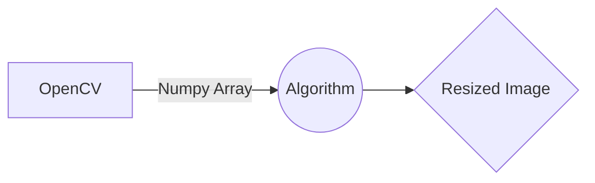

<p align="center">
  
</p>

<p align="center"><b>Author: Serhat Dogan</b><p>
<p align="center"><b>Last update: 16.07.2022</b><p>

<h1 align="center">How does the function works?</h1>

**The function has two paramaters:** *resize(oI, size)*
    
    @jit
    def resize(oI, size)

   1. Original Image (OpenCV & Numpy Array)
   2. Size (Original Image Res. x Size or // Size)
    
 <hr>
    
 **Creating new image:** *Using Numpy*
 
 **pI*: Processed Image, **oI*: Original Image
 
    pI = np.zeros((len(oI)*size, len(oI[0])*size, 3), np.uint8)
    -------------------------------------------------------------
    size *= -1 
    pI = np.zeros((len(oI)//size, len(oI[0])//size, 3), np.uint8)
 
Preparing a canvas for a newly enlarged image using the zeros module from the numpy library.
 
The dimensions of the original image are multiplied by the value entered as a parameter and resized.
 <hr>
 
**Spreading pixels:** *copying pixels on the x and y axes*

We know that there is a numpy array in the original image in which the color values are stored, so with the help of a simple for loop; numpy arrays are shared on the new image by jumping 1 time on the x & x+1 and y & y+1 axes.



    for y in range(0, len(processedImage), 1):
      for x in range(0, len(pI[0]), 1):
        pI[y][x] = oI[y//size][x//size]
    return pI
 
 ```mermaid
graph LR;
    Parameters--> Canvas;
    ProcessedImage --> Loop;
    OriginalImage --> Loop;
    OriginalImage --> Canvas;
    Canvas --> ProcessedImage;
    Loop--> SpreadingPixels;
    SpreadingPixels-->Canvas;
    Canvas-->Final;
```

<hr>

**Increasing and decreasing the image size with parameters:** *resize(img, (+ or - int)times)*

If the size of the image is to be increased, you must send it as a positive int value to be sent as a parameter. On the other hand, if the size of the image is to be reduced, a negative int value should be sent as a parameter.

  1. *resize(img, +3)*
  2. *resize(img, -3)*

<h1 align="center">Why We Should Use Numba?</h1>

Numba translates Python functions to optimized machine code at runtime using the industry-standard LLVM compiler library. Numba-compiled numerical algorithms in Python can approach the speeds of C or FORTRAN.

You don't need to replace the Python interpreter, run a separate compilation step, or even have a C/C++ compiler installed. Just apply one of the Numba decorators to your Python function, and Numba does the rest.

<h1 align="center">Naturalizing The Image</h1>
I'm developing a solution for this, but the simplest solution that can be applied right now would be to add a blur using the OpenCV library.
If you apply a blur operation at the rate that you provide as a parameter to enlarge the image, you can get a good result.
<hr>

***e.g.***

**size**: the parameter entered in the **resize** function

    resizedimage = cv2.blur(resizedimage, (size, size))
